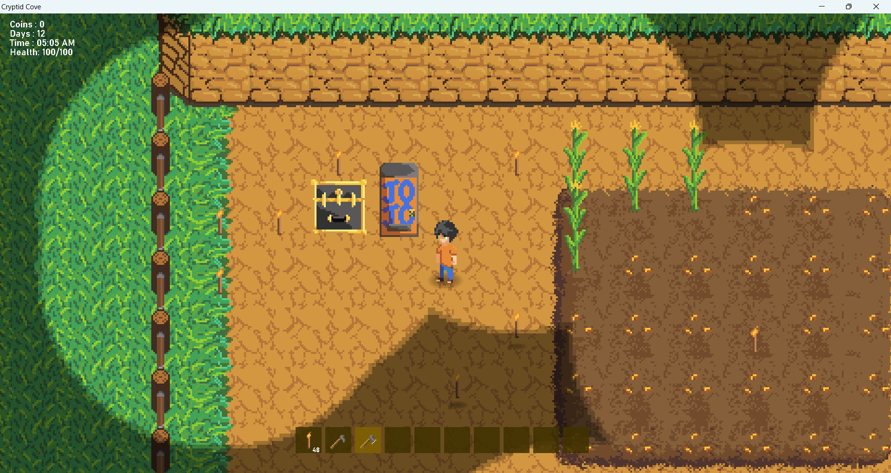

# **Cryptid Cove**
## Game Description 
Farming simulator based in middle of no where michigan, 
a quite place to spend our days faming some land and get to know the locals. 
As you interact with you neighbours you start to see odd signs emerge that the local may not be what they seem.
hopefully getting to know them will uncover there **monstrous** secret, learning and gowing unnatural technics of you very very own.

Magical automation, farming, **cryptids** and more ...... stay tuned, i look foward to developing this further  

### Installation Instructions

to run game open decided version folder and navige to first cryptid_cove.exe

This Saves to a point in "AppData\Local\CryptidCove\savegame.json" -- to resart delete savegame.json 

Sorry for the bad note keeping between 1.0.0 - 1.0.7, will do better in future and try and keep release better updated 

# Playing the game
  W
A S D - Player movment

left Click- does most things like plant, and interact with vedning machine

collision work on cave entrance and exits

Ground must be tiled with hoe to plant seeds

please email cryptidcovesupport@gmail.com for support

